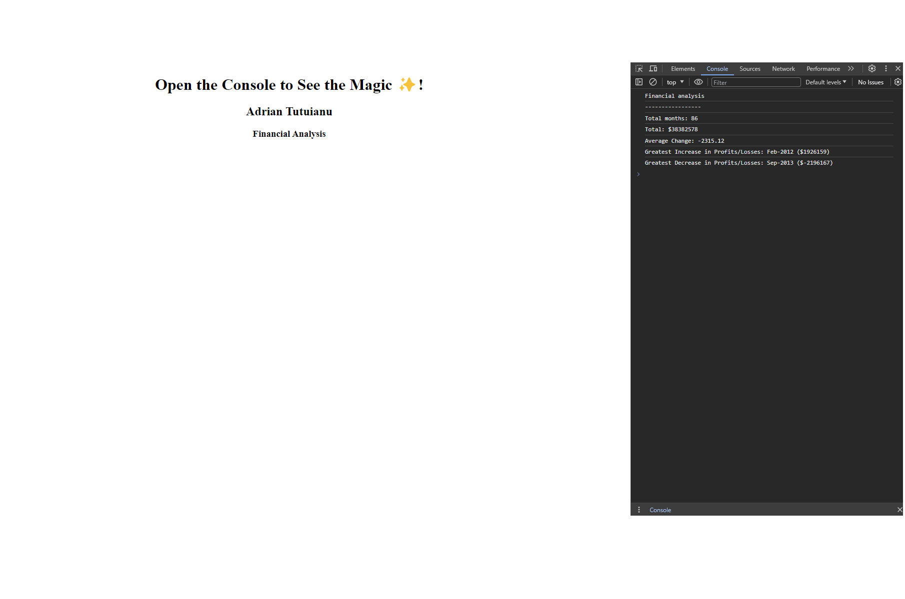

# Unit 4 Challenge: Console Finances

## Description

Financial Analysis: Leveraging the power of 'var,' 'for' loops, and 'if' statements, this app fetches data from an array and logs it to the console dynamically, showcasing the versatility of basic JavaScript constructs."

Technologies Used:

HTML
CSS
JAVASCRIPT

This website was deployed and you can see it live here: https://adriantutuianu.github.io/console-finances-challenge-module-4/

## Installation

Open Console to see the result.

## Usage

## Credits

Edx Front End Web Bootcamp

## License

MIT License
